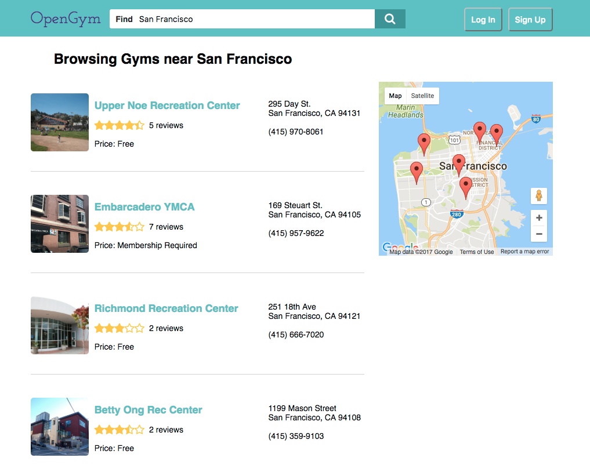
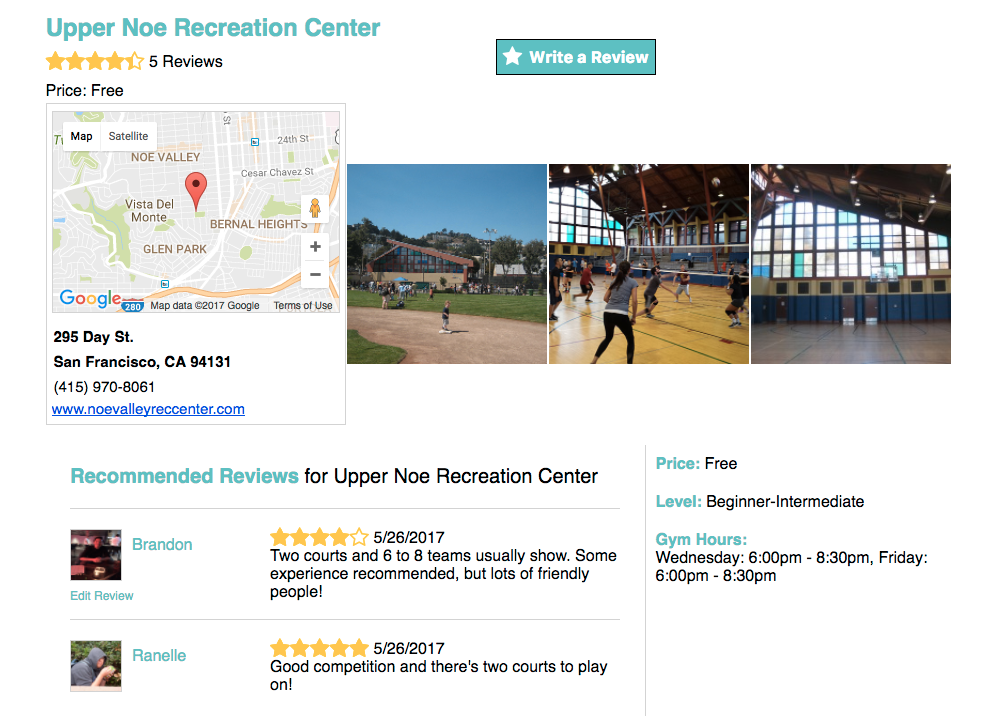

# OpenGym

[OpenGym Live][opengym]

[opengym]: https://opengymvolleyball.herokuapp.com/#/

OpenGym is a web application inspired by Yelp designed to help users find volleyball open gyms within the city of search. The application is built utilizing Ruby on Rails and PostgresSQL database in the back-end, and React/Redux in the front-end.

## Features and Implementation

* Account creation and authentication
* Search for a volleyball open gym in a city
* Search result page with gym address and location through Google Maps
* Gym information page detailing location, level of play, price, and hours of operation
* Create / Edit / Read reviews and ratings about a open gym


### Search Results and Map

OpenGym search results are filtered by the name of the city entered in the search field. The more specific the search, the more accurate the results. The google map is then populated with markers which will have links that can direct you to the Gym information page for you to learn more about the Gym or to leave a review.

```
def index
  if params[:query]
    @gyms = Gym.where('lower(city) LIKE ?', "%#{params[:query]}%".downcase)
  else
    @gyms = Gym.where(city: 'San Francisco').limit(10)
  end
end

```
In the back-end, the search engine will search through all the gyms with the city similar or exactly like the entered search query.



```
gymInfo(gym) {
  let content =
    `<a href=/#/gyms/${gym.id}>${gym.name}</a>
    <div>${gym.address}</div>
    <div>${gym.city}, ${gym.state} ${gym.zip}</div>`;
  let window = new google.maps.InfoWindow({
    content: content
  });
  var marker = new google.maps.Marker({
    position: { lat: gym.lat, lng: gym.lng},
    map: this.map
  });

  marker.addListener('click', () => window.open(this.map, marker));
}
```

In the front-end, using Google Maps Api, the results from the search will be populated on the Map as well on page which the name, location, and rating of the gym.

### Gym Information

The gym show page includes all the information about the gym including days of the week and hours open gym is available, pictures with reference to the gym, and reviews/ratings other users left on the page.



## Future Improvements

### Improved Search Algorithm

Implementing a different search system where users can search by any city and see if any gyms are near the searched city. This will broaden the user experience in case no open gym information is available in the city the user is searching for.

### Uploading Photos of gyms

Users will be able to upload photos of the gym to provide more information to other users who want to see what the gym looks like.

### User Profile

Users will be able to view their personal profile as well as other user profiles. The users will be able to upload photos of themselves and view all the reviews the have posted.
